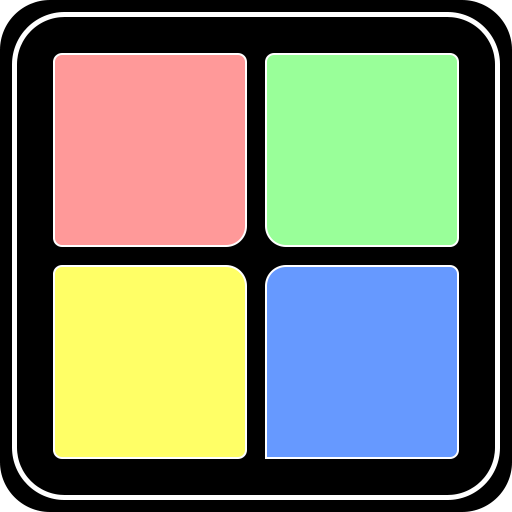

# SimPad

A tool to turn your Novation Launchpad Pro into a controller for Microsoft Flight Simulator

**WARNING**: This is very much a work in progress and currently not in a working state

<br />
<br />

# How to use

### Build electron app for win

```bash
$ yarn build:for:electron
$ yarn electron:builder:win
```

### Build electron app for deb

```bash
$ yarn build:for:electron
$ yarn electron:builder:deb
```

### Start electron app in developer mode

```bash
$ yarn electron:dev
```
